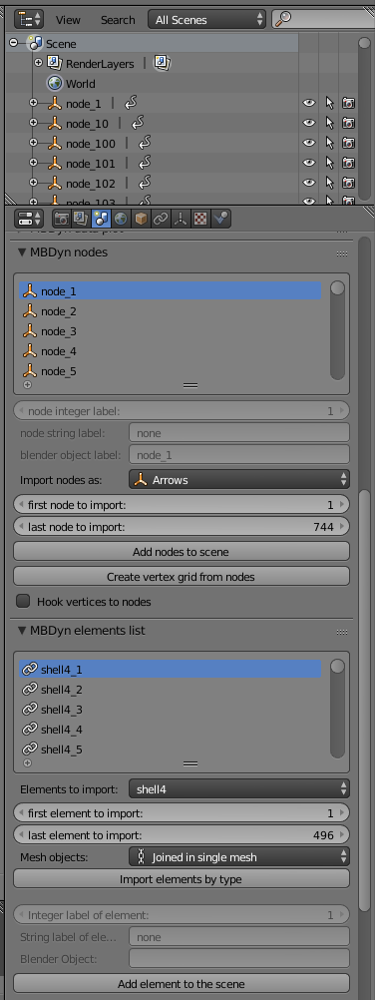
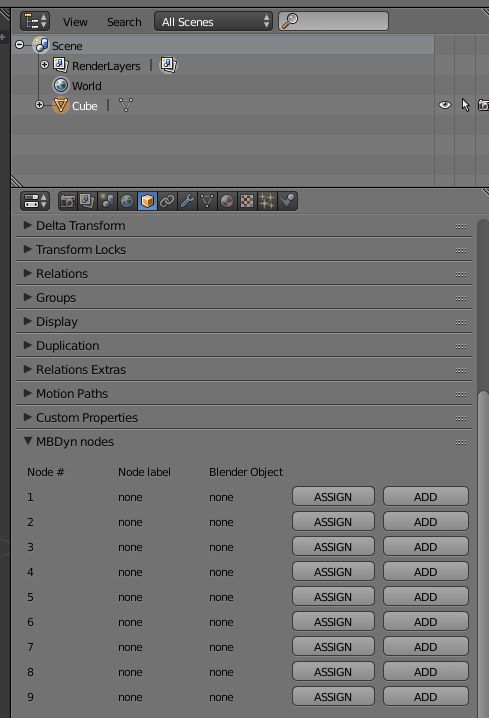

Once installed, the add-on provides for additional panels in the Toolbar (in the
Animation tab) and Properties panels (in the Scene, Object and Data tabs) of [Blender][2].

Assuming that an [MBDyn][1] simulation has been performed
and that the output files have basename `test`, so that the standard output
would consist in the `test.mov`, `test.log`, `test.jnt` and `test.out` files,
and the [NetCDF][3] output in the `test.nc` file, the general procedure to import
and visualize the model are described in the following sections.

# Step 1: Select the results file
From the left toolbar panel, located in the Animation tab of the 3D view area of
Blender, click on the `Select results file` button and locate the `test.mov` or 
`test.nc` file of the simulation output. The binary output is recommended, since its
manipulation in [Blender][2] is much faster, and it enables plotting. 

Please note that the `.mov` or `.nc` file *does not* necessarily contain
a valid simulation output: the initial structure of the model is loaded from the
`.log` file, which is always written, even in the case the initial assembly phase
fails. The results file selection essentially is used to identify
the path and the basename of the [MBDyn][1] output files.

- - - 

- - - 

If the results file is properly located, some general info about its structure is
displayed after the "Loaded results file" label in the panel. Please notice that
until the `.log` file is loaded, the number of nodes and number of time steps in
the info panel will remain null.

## Step 2: Load the .log file
Once the basename and the path of the simulation output files has been set by
the selection of the `.mov` or `.nc` file, the `.log` file can be loaded by
pressing the `Load .log file` button in the panel. 

If you remove nodes from your MBDyn simulation, re-run it, and reload the log file, a warning will appear in the header.
38
"Some of the nodes/elements are missing in the new .log file"
The nodes concerned will have been treated according to the instructions given in the drop-down menu below the load log file button, with the options `Delete`, `Hide`, and `Do Nothing`

The same behavior applies if you load results from a different MBDyn simulation where nodes are "missing" with respect to the previously loaded one.

A message should appear in
the [Blender][2] toolbar at the top, informing the user that all the
[MBDyn][1] entities have been imported correctly. The number
of nodes and number of time steps is now displayed in the panel above the `Load
.log file` button.

## Step 3 [optional]: load labels from .log file
The add-on will, by default, assign a standard labeling to the imported
[MBDyn][1] entities, based on the integer labels found in
the `.log` file. If a different labeling is desired, the add-on can parse the `.log`
file searching for variables that correspond to labels for nodes and elements. 
The labels should be defined in the [MBDyn][1] input files with `set`
statements in the following (alternative) forms, where the '[Nn]ode\_' part is
obligatory:

- - - 
	set: integer node_ground = 1;
	set: integer Node_ground = 1;
	set: integer NODE_ground = 1;
	set: const integer node_ground = 1;
	set: const integer Node_ground = 1;
	set: const integer NODE_ground = 1;
- - - 

In this case, the object associated to node 1 will be called node_ground,
(or Node_ground or NODE_ground) when it is added to the Blender scene.
In the same way, the labeling can be assigned to joints and beams. For example

- - - 
	set: integer joint_revolute = 1;
	set: const integer BEAM_cantilever = 5;
	set: integer JOINT_cardano = 1700;
	set: integer Beam_Link = 435;
- - - 

all generate valid labels. Please notice, though, that at the current state the
majority of [MBDyn][1] elements is still unsupported for automatic import in 
[Blender][2].

## Step 4: Add [MBDyn][1] nodes to the [Blender][2] scene automatically 
## or assign them to existing Blender objects
Once the `.log` file has been loaded, the add-on populates two lists of
[MBDyn][1] entities in the Properties toolbar of Blender, under the Scene tab.

- - - 

- - -

The first list is made of the [MBDyn][1] nodes found in the
`.log` file of model. Selecting a node in the list will update the info shown
at the bottom of the list: the string label of the node is not "none" only if
the label corresponding to the node has been found. The button `Add nodes
to scene` triggers the spawning of a Blender object for each node in the list,
of the type selected in the dropdown menu next to `Import node as:`. The
default is an `Empty` of type `Arrows`. The position orientation of object will
match the initial position and orientation the node itself as found in the
`.log` file. By default, the `Add nodes to scene button will import all the nodes
in the list`, but its behavior can be modified by setting the first and last node
to import, in the two sliders above the button.

The second list contains the elements found in the `.log` file and recognised by
the add-on. Please notice that *this is the most experimental part of the add-on*,
and that *the majority of the elements are not supported as of now*. Only `rod` 
joints, `beam2`, `beam3` and `shell4` elements are supported fully. 
The `Add element to the scene` button will spawn an object
representing the selected element in the list. All the elements of a selected type
can be imported at the same time by using the `Import elements by type` button.
The type shown in the dropdown menu matches that of [MBDyn][1], with the exception
that joint elements types are followed by a "j".

As shown for nodes, it is possible to import elements with labels in a specified 
interval. A dropdown menu is displayed in the case `shell4` elements are
selected in the `Elements to import` menu, providing the choice of importing
all shells as separated mesh objects or into a single mesh. Please visit the
[shell elements page][4] for more details.

If a Blender object is selected, another panel is drawn in the
Properties->Object sidebar. The Panel allows the user to directly assign an
[MBDyn][1] node to the currently selected Blender object by
pressing on the "ASSIGN" button, or to import it separately using the "ADD"
button. In the first case, the node will be associated with the Blender object,
using the Blender local Axes of the object as the reference frame: basically,
the node position and orientation will be assigned to the position and
orientation of the Blender Axes for that object. The user should put care into
moving the Blender axes in the correct position with respect to the mesh to
reproduce the correct visualization. 
- - - 

- - - 

### Create vertex grid from nodes
This button will create a cloud of vertices from the nodes initial locations. If
the `Hook vertices to nodes` checkbox is active, then the position of the vertices
will be *hooked* to those of the [MBDyn][1] nodes, so the vertices will follow the 
[MBDyn][1] nodes during the animation. This feature is also experimental: it can be
useful when the user wants to have more control in designing its own mesh when importing
[MBDyn][1] results.

## Step 5: Animate the Blender scene
Once all the nodes and the elements of interest are loaded in the Blender scene,
pressing the `Animate scene` button in the Animation toolbar (left panel)
will trigger the addition of keyframes and the update of the position and
orientation of each Blender object that is associated with an
[MBDyn][1] node or
element, according to the simulation outputs contained in the loaded `.mov`
file.
As an option, the user can select to animate the scene only once every *n*
timesteps, where *n* is a number set with the "frequency" slider found just below the `Animate Scene` button.
When *n* is not an integer, the coordinates/angles are calculated
with a linear interpolation of the nearest timesteps.

You can select the start and the end time of the animation (in seconds), thereby 
animating only a slice of the total results. You can set them in the `Start Time` and
`End Time` sliders, under the section "Time Range of import".

The `Simulation time` slider shows the time of the simulation
corresponding to the current animation frame. 

You do not need to repeat the process every time you simulate the same model.
You can follow the below steps:

* load the new results file, with the `Load results file` button.
* If you have new nodes/elements in your model, do not forget to load those new nodes/elements into
the Blender scene (Step 4). Otherwise, just continue to the next step.
* press the `Animate scene` button again.

In the case your model has changed considerably, but you want to keep the
Blender object in the current `.blend` file intact, you can press the `CLEAR
MBDYN DATA` button and start from scratch. This will wipe all the data that 
was read from the [MBDyn][1] output.

## Logging
Messages are generated in Blender's window header to give the user feedback,
and help debug a possible problem.
To let the user keep track of all the report messages generated, a `.bylog` file is created
in the same directory as the results files.
The same file is also created in the Text Editor buffer in Blender, which you can view by switching
to the Text Editor context and selecting the corresponding log file from the drop-down menu.

This is how the log messages look.

`
06/30/2017 04:24:25 PM - WARNING - [base.py:792] - No output for nodes 1
06/30/2017 04:24:25 PM - INFO - [base.py:833] - MBDyn entities imported successfully
06/30/2017 04:25:44 PM - ERROR - [plotlib.py:411] - Please save current Blender file first
`

The Blendyn log file is created in the directory of the MBDyn results. It has the `{anim_file}_{results_file}.bylog` name, where {anim_file} is Blender's animation filename root or "untitled" if the Blender file is unsaved and {results_file} is the root name of MBDyn's result files.

All the report messages are logged to it, along with the time, type of message, and location of generation in Blendyn's codebase. Upon saving the Blender file for the first time, Blendyn's log file will be renamed according to the rules just mentioned.

  [1]: https://www.mbdyn.org/
  [2]: https://www.blender.org/
  [3]: http://www.unidata.ucar.edu/software/netcdf/
  [4]: https://github.com/zanoni-mbdyn/blendyn/wiki/Shells 
