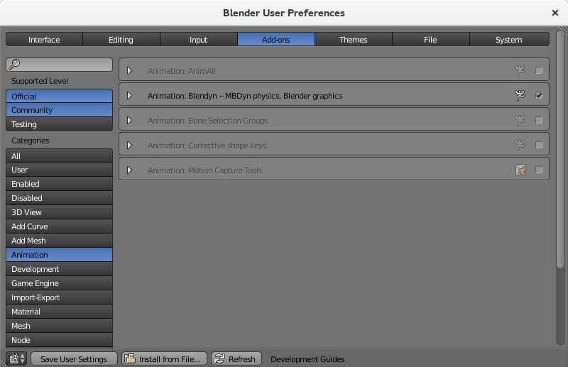
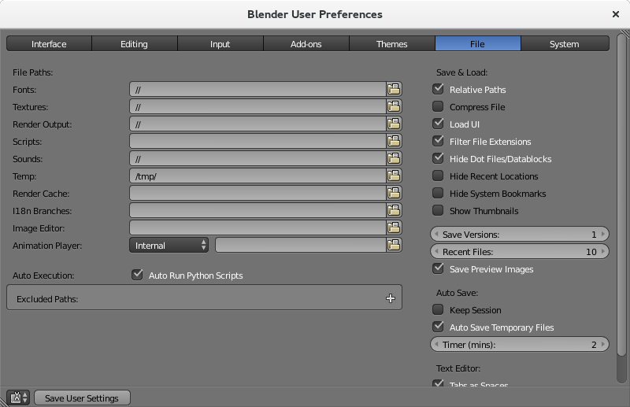

# Basic Installation
The basic installation of the add-on is very simple. Download the repository as a
`.zip` file using the **Download ZIP** button at the top right of the repository
[main page](https://github.com/zanoni-mbdyn/blendyn/). 

You can also choose to download the official releases 
[here](https://github.com/zanoni-mbdyn/blendyn/releases). Just please make sure to 
download the `.zip` version of the source code and to **rename** the file `blendyn-master.zip`
**before** installing the add-on.

> NOTE: please check that the current active branch is "master", unless you are
> an MBDyn developer or, in general, have access to the bleeding edge MBDyn's 
> repository.

In [Blender](http://www.blender.org/), go to `File -> User Preferences -> Add-ons`
and then click on the `Install from File...` button and locate the `.zip` file
that you have downloaded. The add-on will be shown under the `Animation`
category. You will have to activate it in the usual way, by clicking on the
checkbox on the right.

> If, upon the activation of the add-on, complaints that the `numpy` package
> is not installed, please follow the instructions below to install `pip`, if
> it is not already present in your system, and then install `numpy` with
>
> `# pip install numpy`
>
> or
>
> `# pip3 install numpy`

---

---

Additionally, for deformable elements to be visualized correctly, you need to
activate the `Auto Run Python Script` option in the `File` tab of the Blender
User Preferences, as shown in the picture below.

---

---

# Optional Packages 
A few optional packages are needed to enable importing
[MBDyn](https://www.mdbyn.org/) results in
[NetCDF](http://www.unidata.ucar.edu/software/netcdf/) format, which in turn is
needed to enable the plotting of [MBDyn](https://www.mbdyn.org/) from the 
[Blender](https://www.blender.org) interface.

## Linux
### Fedora 23, 24 and 25
Just install Blender from the repos (This is **important**, as the Blender
version from the repos will work with the *system* version of Python, and does
not come with a bundled python distribution) and install the python packages needed to
support the additional features.
You can do it with [pip](https://pypi.python.org/pypi/pip), that in turn you can install with 
- - - 
`# dnf install python3-pip`
- - - 
For NetCDF support:
- - -
`# pip install netCDF4 `
- - - 
for plotting support: 
- - -
`# pip install pygal cairosvg tinycss lxml cssselect`
- - - 
Notice that NetCDF support is currently required to enable plotting.
Other system packages might be required by `pip` during the installation, for example
`hdf5-devel`, `python3-cffi`, `libffi-devel`, `netcdf4-python3`. Pay attention
to the error messages, as you should always do :)

### Ubuntu 14.04 LTS and 16.04 LTS
The procedure is similar to the Fedora one. Again, this assumes that you have
installed Blender *from the Ubuntu repos*. Install
[pip](https://pypi.python.org/pypi/pip) if it is not installed yet
- - - 
`# apt-get install python3-pip`
- - - 
then install the python packages. For `NetCDF` support
- - -
`# pip3 install netCDF4`
- - -
You might be warned by `pip3` that some required libraries are not installed in
your system (quite probably at least `libhdf5-dev`). You can do it in the usual 
way with `apt-get` or `aptitude`.

For plotting
- - -
`# pip3 install pygal cairosvg tinycss lxml cssselect`
- - -
Again, NetCDF support is required to enable plotting.
Pip might tell you that some dependencies are not met. For example, it might ask
you to install also `libffi`. If that is your case, you can do it in the usual
way with
- - - 
`# apt-get install libffi-dev`
- - -
Please be aware that I'm not totally sure that the development package is needed
here: `pip` might be happy with just the regular `libffi` package.

### MacOSX
This is were things get interesting. I'll just give my experience with `OsX
10.9.5`, `Blender 2.76b` and `MacPorts`. Be aware that YMMV, greatly, if you
try other combinations.

First install the python34 port and the related pip port:
- - -
`# port install python34 +readline`

`# port install py34-pip`
- - -
the `+readline` variant is useful if you plan to also use this python version
interactively from command line, otherwise it can be dropped.
Now you can install the python packages with pip
- - - 
`# pip3.4 install netCDF4 (for NetCDF support)`

`# pip3.4 install pygal cairosvg tinycss lxml cssselect`
- - -
Again, the second row is useful only if you want to enable plotting.
Now you have installed everything you need. You need now to make sure that
Blender bundled python distribution can see the packages. 
The simplest way is to make a simlink of the `site-packages` MacPorts folder to
the one in the Blender application folder:
- - -
`$ cd /Applications/blender-2.76b-OSX_10.6-x86_64/blender.app/Contents/Resources/2.76/python/lib/python3.4 `

`# ln -s /opt/local/Library/Frameworks/Python.framework/Versions/3.4/lib/python3.4/site-packages site-packages`
- - - 

### Windows
Not tested yet... You're welcome to do it and tell us how it went! :)
