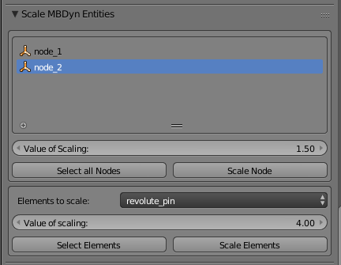

## 1. Scaling [MBDyn][1] entities

To help scale [MBDyn][1] entities easily, i.e. [Blender][2] objects associated with [MBDyn][1] nodes and elements, there is a
`Scale [MBDyn][1] Nodes` Panel beneath the `[MBDyn][1] elements`.

- - - 

- - -

### Scaling Nodes
 * * To scale a single node, select the node you want to scale from the displayed list.
   * Enter the value you want to scale the node to, in the field marked as `Value of Scaling`
   * Press the button `Scale Node` to scale the selected node to the scale value entered.

* * To scale all the nodes at once, press the button `Select all Nodes`. This selects all the node objects
in the [Blender][2] scene.
  * Scale the objects through by pressing `S`, and then just type the scaling value through the keyboard.
  
  (This method of scaling is an intrinsic feature of [Blender][2], not Blendyn.
  You can scale any selected [Blender][2] object(s) though this method)
  
  
### Scaling Elements

You can scale [MBDyn][1] element objects through groups of their type. If you want to scale individual
elements, you can just select the element from the [Blender][2] scene, and scale accordingly.

* If you want to scale elements through their types (body, revolute joint, in line, etc), select the type of elements
you want to scale through the dropdown `Elements to scale`.
* Enter the value of scaling in the field marked as `Value of scaling`.
* Press the button `Scale Elements` to scale the element objects to the entered value.
* To scale the elements through the [Blender][2] UI, press the button `Select Elements`.
This selects all the [Blender][2] objects associated with that element type.
* Scale the objects through by pressing `S`, and then just type the scaling value through the keyboard.

  [1]: https://www.mbdyn.org/
  [2]: https://www.blender.org/
