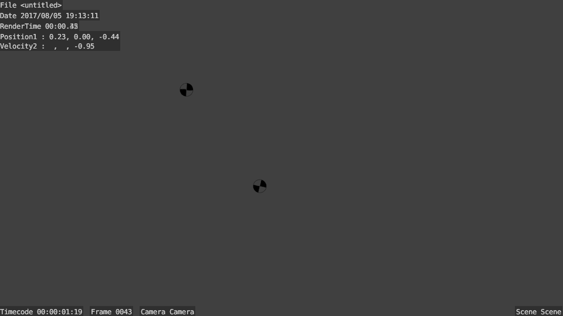

## 1. Scaling [MBDyn][1] entities

To help scale [MBDyn][1] entities easily, i.e. [Blender][2] objects associated with [MBDyn][1] nodes and elements, there is a
`Scale [MBDyn][1] Nodes` Panel beneath the `[MBDyn][1] elements`.

- - - 

- - -

### Scaling Nodes
 * * To scale a single node, select the node you want to scale from the displayed list.
   * Enter the value you want to scale the node to, in the field marked as `Value of Scaling`
   * Press the button `Scale Node` to scale the selected node to the scale value entered.

* * To scale all the nodes at once, press the button `Select all Nodes`. This selects all the node objects
in the [Blender][2] scene.
  * Scale the objects through by pressing `S`, and then just type the scaling value through the keyboard.
  
  (This method of scaling is an intrinsic feature of [Blender][2], not Blendyn.
  You can scale any selected [Blender][2] object(s) though this method)
  
  
### Scaling Elements

You can scale [MBDyn][1] element objects through groups of their type. If you want to scale individual
elements, you can just select the element from the [Blender][2] scene, and scale accordingly.

* If you want to scale elements through their types (body, revolute joint, in line, etc), select the type of elements
you want to scale through the dropdown `Elements to scale`.
* Enter the value of scaling in the field marked as `Value of scaling`.
* Press the button `Scale Elements` to scale the element objects to the entered value.
* To scale the elements through the [Blender][2] UI, press the button `Select Elements`.
This selects all the [Blender][2] objects associated with that element type.
* Scale the objects through by pressing `S`, and then just type the scaling value through the keyboard.

## Text Overlay in Rendered Images

This feature allows you to overlay data from the simulation over rendered animations.

This is done by using the same display variables used in plotting multiple variables.

This feature, like Plotting, only works with [netCDF][3] output.

Follow the below steps:

* Create a list of Display variables by following the steps [here](https://janga1997.github.io/abaqus/).

* Add nodes and elements to the scene, and animate the scene, by following the steps [here](https://github.com/zanoni-mbdyn/blendyn/wiki/Basic-Usage)

The below steps are more related to Rendering Animations in [Blender][2], and less with Blendyn.

* Make sure your camera is positioned and oriented correctly in the scene.

* Switch to the `Video Editing` Screen, and add the Scene to `Video Sequence Editor`.

* Generate the rendered images, by pressing the `Animation` button in the `Render` tab of the `Properties` toolbar.
    - You should see the display variables being printed onto the rendered images, for only the components you selected.

Here is an example image:

- - - 

- - -

* After the Render has completed, erase the Scene strip from the Video Sequence Editor, and add an `Image` strip.

* Navigate to the directory in you generated the images, and select all the images by pressing `A`.

* Select a File format for the video to be saved in `Render` tab of the `Properties` toolbar.

* Generate the video file by pressing `Animation` again.

  [1]: https://www.mbdyn.org/
  [2]: https://www.blender.org/
  [3]: http://www.unidata.ucar.edu/software/netcdf/
