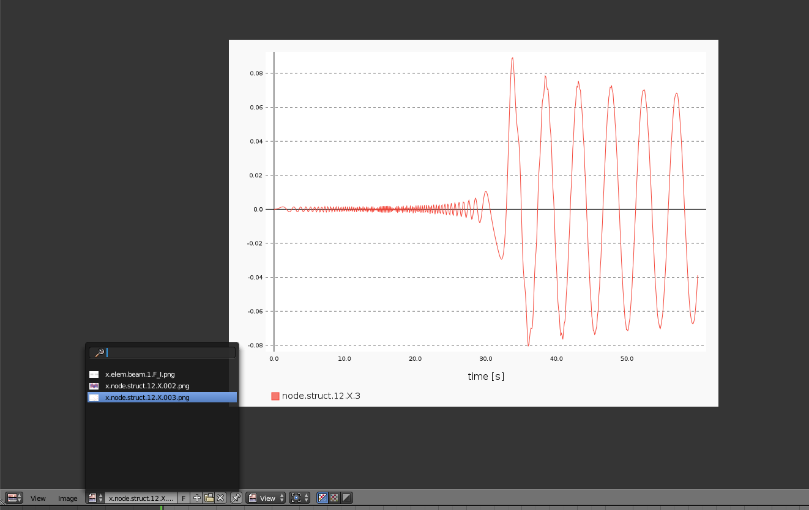

**Blendyn** relies on the Python module [Pygal][1] for generating 2D
plots of [MBDyn][2] output variables. 

Plotting is, currently, enabled only for [NetCDF][3] results. You can refer to
the [Installation guide][4] to setup the additional packages that you need to
enable both the [NetCDF][3] output in [MBDyn][2] and its import and plotting in
**Blendyn**.

When [NetCDF][3] and [Pygal][1] modules are found, the add-on will create two
additional panels devoted to plotting: one in the Object Properties panel and
the second one in the Scene Properties panel. 

# Plotting a variable belonging to an object
Once you have correcly imported an element into the [Blender][5] scene, a panel
called `MBDyn data plot` will appear in the Object Properties panel, as shown in
the image below
- - - 

- - - 
All the [NetCDF][3] variables in the [MBDyn][2] output related to the currently
selected object will be shown in the drop-down menu next to the `Variables:`
label. You can select the variable you want to plot, and optionally deselect the
components you're not interested in. You can plot the variable in the time
domain or in the frequency domain, selecting "Autospectrum" in the `plot type`
dropdown menu. Upper and lower limits to the abscissa values can be set via the
two dialog boxes underneath the selection of the plot type.

The `frequency` property has the same meaning of the import `frequency` shown in
the Animation Toolbar under `Animate scene`: set it to `n` to plot the variable
using one point in every `n`. The `Use import freq` button can be used to set
the plotting frequency equal to the import frequency. 

When you press on the `Plot variable` button for the first time, the add-on will
try to create a directory called `plots` in the directory holding the current
`.blend` file. If you have not yet saved the [Blender][5] file, you'll be asked
to do so. Then, an `.svg` file and a preview `.png` file of the plot you
requested will be created. You can load the `.png` file in the Image Editor
simply by clicking on the image icon next to `Image` and selecting the file. 

If you plot multiple variables before switching to the Image Editor, all the
plots images will be available in the list, as shown in the picture below

- - - 

- - -
# Plotting a variable(s) belonging to the model

## Plotting single variable
Instead of selecting an object and plotting variables belonging to the
associated [MBDyn][2] entity, you can also use the Scene Property panel shown in
the picture below
- - - 

- - - 
Here, all the variables found in the [NetCDF][3] output of the model are listed.
Again, you can choose the variable that you want to plot, activate/de-activate
the components that you are interested in, and plot it with the `Plot variable`
button, possibly after setting the plotting frequency. 

Notice that the list of variables that appears in the panel can also be
filtered in the usual way for [Blender][5] UI lists: click on the small `+`
button at the lower left corner of the list to bring up the filtering and
ordering options.

## Plotting multiple variables
You can plot multiple variables in the same plot, by using the burton `Set Display Variable`.

Follow the below steps:

* Select a variable from the Plot Variables list, and deselect the components you do not want.

* Set the name of the variable in the field `Name of variable`.

* Add the plotting variable to the list by clicking on `Set the Display Vairable`.

- - - 

- - - 

* You can see the variables being added to the list, with their corresponding names.

    You can also see the individual components for each variable being denoted with the set of integers `1, 2, 3`.

    `[1, 2, 3] -> [x, y, z]`

* Plot the variables in the list by pressing the button `Plot variables in List`

* You can view the plot by switching to the `Image Editor`, and selecting the corresponding image. The plot is saved as `{results_file}.png`.

* You can delete a variable from the list, by selecting the corresponding variable in the list, and pressing `Delete Display Variable`

* To remove all variables from the list, press `Clear`

## Plotting Variables in Groups

You can plot variables in groups of lists, so it would be easier to generate plots iteratively.

* Make a list of variables by following the steps laid out above.

* Enter the name fo the group in the field `Name of Display Group`, and press the button `Set Display Group`.

* You can see your group being added to a dropdown below.

* To create a new group, press `Clear` to clear the variables list, and repeat the above steps to create a new group.

* You can see all the groups you create being added to the dropdown below.

- - - 

- - - 

* To plot the variables in a group, select the group from the dropwdown list

* Press the `Show Display Group` to populate the variable list with the selected group's variables.

* Be sure to check the `Plot Group` checkbox as true.

* Plot the variables with the `Plot Variables in List` button.

* The plot will be saved as `{results_file}..{group_name}.png`. You can view it from the `Image Editor` as instructed in the previous sections.

  [1]: http://www.pygal.org/en/latest/
  [2]: https://www.mbdyn.org
  [3]: http://www.unidata.ucar.edu/software/netcdf/
  [4]: https://github.com/zanoni-mbdyn/blendyn/wiki/Installation
  [5]: https://www.blender.org/

